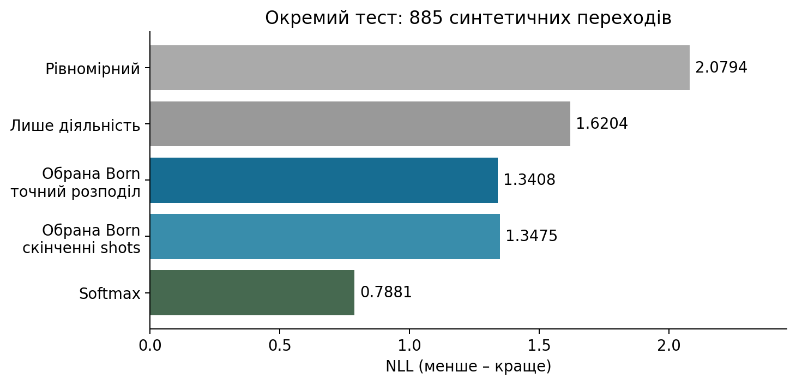

# Практична робота 001 Квантова модель та EEG у цифровому двійнику

Тема дисертаційного дослідження: **«Методи та програмні засоби побудови цифрових двійників когнітивного стану людини на основі квантових моделей та метаевристик»**.

Цей репозиторій містить лекцію, практичну роботу, дані, виконуваний приклад і контрольні результати. Студент досліджує спостереження EEG, навчає умовну модель Борна, добирає її конфігурацію через NSGA-II та перевіряє програмний модуль цифрового двійника з класичним резервним прогнозом. Рисунки Matplotlib побудовано з обчислених результатів.

## Навчальні матеріали

| Матеріал | PDF | Редагований Word |
|---|---|---|
| Лекція 2, 11 сторінок | [Читати лекцію](Лекція_2_конспект_оновлено.pdf) | [DOCX](Лекція_2_конспект_оновлено.docx) |
| Лабораторна 1, заняття 3, 9 сторінок | [Читати практичну](ЛР1_Заняття_3_оновлено.pdf) | [DOCX](ЛР1_Заняття_3_оновлено.docx) |

Редакція матеріалів: 08.10.2026. Рекомендований порядок: лекція, практична, запуск основного прикладу, виконання трьох функцій, власний звіт із розділом «Результати».

## Вимоги

- Python 3.11–3.13. Контрольний локальний запуск виконано на Python 3.13.5; автоматична перевірка налаштована на Python 3.13.
- NumPy 2.1.3, SciPy 1.15.3, scikit-learn 1.6.1, Matplotlib 3.10.0. Версії зафіксовано у [requirements.txt](requirements.txt).
- Звичайний CPU. GPU, обліковий запис квантового сервісу і фізичний квантовий процесор не потрібні.
- Інтернет потрібний для завантаження репозиторію та встановлення залежностей. Включених даних достатньо для подальших запусків офлайн.

## Завантаження та встановлення

```text
git clone https://github.com/MishaVernik/practice-001-quantum-eeg-digital-twin.git
cd practice-001-quantum-eeg-digital-twin
```

Альтернатива без Git: **Code → Download ZIP**, розпакуйте архів і відкрийте термінал у корені отриманої папки. Завантажуйте весь репозиторій: три навчальні папки мають залишатися поряд.

У Windows PowerShell створіть середовище та активуйте його:

```powershell
py -3.13 -m venv .venv
.\.venv\Scripts\Activate.ps1
python -m pip install -r requirements.txt
```

Якщо команда `py` недоступна, використайте `python -m venv .venv` із Python підтримуваної версії. Якщо PowerShell блокує активацію, її можна пропустити: замініть `python` у командах нижче на `.\.venv\Scripts\python.exe`, зокрема під час встановлення залежностей.

У Linux або macOS:

```bash
python3 -m venv .venv
source .venv/bin/activate
python -m pip install -r requirements.txt
```

## Основний приклад

Усі наведені нижче команди виконуються **з кореня репозиторію**:

```text
python twin_lab/run_twin.py --out runs/twin
```

Команда заново навчає шість схем Борна, оцінює 30 конфігурацій, виконує NSGA-II, фіксує вибір за валідаційними даними й лише після цього обчислює тестові прогнози. Вона працює одразу, незалежно від невиконаних студентських завдань.

У `runs/twin` з’являться:

| Файл | Зміст |
|---|---|
| `report.json` | Розбиття, параметри, навчальні втрати, результат пошуку, NLL та приклади відповіді двійника |
| `configurations.csv` | Обчислені оцінки всіх конфігурацій, відвідування NSGA-II та фронт Парето |
| `selected_predictions.npz` | Ймовірності Born і softmax, цільові рівні та ідентифікатори днів |
| `architecture.png` / `.svg` | Схема програмних компонентів |
| `learning.png` / `.svg` | Збережені навчальні втрати після ініціалізації, 1 та 8 епох |
| `pareto.png` / `.svg` | Валідаційна якість і ресурсні витрати |
| `twin_result.png` / `.svg` | Порівняння моделей на окремому тесті |

Для повторного запуску вкажіть нову папку, наприклад `--out runs/twin_02`. Скрипти зберігають попередні результати й відмовляються перезаписувати наявний каталог. Папка `runs` виключена з Git.

## Завдання студента

Заповніть три функції у [twin_lab/tasks.py](twin_lab/tasks.py):

1. `nll` – обчислення від’ємної логарифмічної правдоподібності за фактичними мітками.
2. `choose_config` – вибір конфігурації за валідаційною якістю в заданому ресурсному бюджеті.
3. `route_probability` – вибір доступного прогнозу та перевірка вектора ймовірностей.

Після реалізації запустіть:

```text
python twin_lab/check_twin.py --run runs/twin
```

Очікуваний результат – `PASS`. До заповнення функцій перевірка повідомить про невиконане завдання. Це очікувана поведінка заготовки. До звіту додайте приклади даних, схему, графіки, обрану конфігурацію, перевірку резервного режиму та окремий розділ «Результати».

Для викладача доступний незалежний запуск еталонних функцій:

```text
python twin_lab/check_twin.py --solution --run runs/twin
```

## Дані та їх призначення

| Джерело | Що міститься в репозиторії | Для чого використовується |
|---|---|---|
| Neuroergonomics 2021 | Реальні підготовлені EEG-епохи й ознаки 15 учасників, дві сесії кожного; 61 канал, 250 Гц | Оцінка складності поточного MATB-II та порівняння з CLI |
| Синтетичний часовий стенд PhD | Генератор 15 днів із діяльностями email, coding, reading і переходами між вісьмома рівнями | Навчання умовного прогнозу, добір конфігурації та тестування інтеграції |
| OpenNeuro ds003838 | 65 ECG/PPG-вікон восьми учасників і приклад часових відліків | Додаткова перевірка узгодженості частоти, HRV та PRV |
| FACED | Збережені тестові прогнози й мітки підмножини, без вихідних EEG-записів FACED | Додатковий аналіз обмежень розпізнавання amusement |

Реальні EEG та синтетичні дні належать різним доменам. Адаптер повертає для EEG поточну оцінку з `forecast=null`; він не дозволяє прикріпити до неї синтетичний прогноз. Для синтетичного домену доступні `born_simulator` і `classical_fallback`. Навчальний модуль не видає рекомендацій щодо плану діяльності людини.

Синтетичні переходи поділено хронологічно: 1416 навчальних, 354 валідаційних, 885 тестових. Межі рівнів визначаються на навчальній частині. Повний опис полів, одиниць, джерел і обмежень: [data_lab/README.md](data_lab/README.md). Походження й контрольні суми вихідних матеріалів збережено у `provenance.json` відповідних папок.

## Результати

NLL – від’ємна логарифмічна правдоподібність. **Менше значення означає кращу ймовірнісну оцінку фактичних результатів** на тому самому тесті.

| Модель | NLL на 885 тестових синтетичних переходах |
|---|---:|
| Рівномірний розподіл | 2,079442 |
| Лише тип діяльності | 1,620371 |
| Обрана Born, точні ймовірності | 1,340814 |
| Обрана Born, 256 змодельованих вимірювань | 1,347543 |
| Класична softmax | 0,788074 |

NSGA-II обрав три шари з CNOT і 256 вимірюваннями за бюджетом 4608 логічних gate-shots. Валідаційний NLL=1,282438; вибір збігся з контрольним повним перебором. Ця ресурсна міра не є часом фізичного квантового пристрою. Повний перебір використано як контроль малого простору; економію загального часу метаевристикою тут не доведено.

Born краща за рівномірний розподіл і модель лише за діяльністю; softmax краща за Born. Квантова перевага не заявляється. Окрема перевірка реальних EEG дає середній AUROC=0,7778 за 15 учасниками після калібрування за спокоєм. AUROC не є відсотком правильних відповідей. Ці експерименти не підтверджують наскрізне прогнозування чи користь персонального планування для реальної людини.



Контрольні числа: [звіт основного експерименту](twin_lab/reference_run/report.json), [оцінки конфігурацій](twin_lab/reference_run/configurations.csv), [результати фізіологічних даних](data_lab/reference_run/results.json). На іншій платформі допустимі невеликі числові відмінності; порівнюйте метрики з указаною точністю.

## Додаткові приклади

Повторна перевірка реальних даних, еталонних обчислень і включеного ECG/PPG-вікна:

```text
python data_lab/run_real.py --out runs/data
python data_lab/check_tasks.py --reference
python data_lab/recompute_probe.py
```

Цей запуск заново навчає EEG-класифікатори, перераховує CLI та аналізує включені кардіальні результати й прогнози FACED. Він не навчає модель емоцій заново. Додаткові студентські вправи розміщено у `data_lab/tasks.py`; після їх виконання перевірка запускається без `--reference`.

Попередній прогнозний стенд можна відтворити зі збережених ймовірностей:

```text
python trajectory_lab/run_lab.py --mode replay --out runs/trajectory
python trajectory_lab/check_lab.py --solution
```

Режим `--mode train` цього скрипта заново навчає моделі. Деталі: [trajectory_lab/README.md](trajectory_lab/README.md). Основною роботою цього репозиторію залишається `twin_lab`.

## Структура репозиторію

```text
README.MD                  Початок роботи
requirements.txt           Фіксовані залежності
Лекція_2_конспект_оновлено.* Лекція у PDF та DOCX
ЛР1_Заняття_3_оновлено.*     Практична у PDF та DOCX
twin_lab/                  Основний експеримент та інтеграція
data_lab/                  Реальні приклади та аналіз даних
trajectory_lab/            Моделі прогнозування та попередній стенд
.github/workflows/          Автоматична перевірка виконання
verification.json          Запис перевірок навчального пакета
MANIFEST.sha256            Контрольні суми навчальних файлів
```

GitHub Actions запускає повний основний приклад, еталонні перевірки й аналіз фізіологічних даних. Результати доступні у вкладці **Actions**, у відповідному запуску як артефакт `teaching-results`. Автоматична перевірка використовує еталонні функції; вона не підміняє перевірку самостійно виконаних студентських завдань.

## Джерела

Походження включених файлів: [DATA_SOURCES.md](DATA_SOURCES.md).

- [Neuroergonomics 2021 pBCI competition](https://doi.org/10.5281/zenodo.4917218).
- [OpenNeuro ds003838 v1.0.6](https://doi.org/10.18112/openneuro.ds003838.v1.0.6).
- [FACED dataset](https://doi.org/10.1038/s41597-023-02650-w).
- Локальні копії опису методу PhD і попереднього експерименту: [twin_lab/evidence](twin_lab/evidence).

Для запозичених даних зберігаються умови їхніх першоджерел; цей навчальний пакет не змінює їх. Необхідні бібліографічні посилання та походження даних наведено вище й у відповідних README та provenance-файлах.

Вернік М. О.
